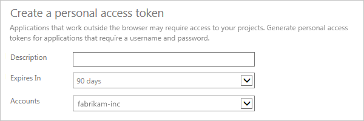
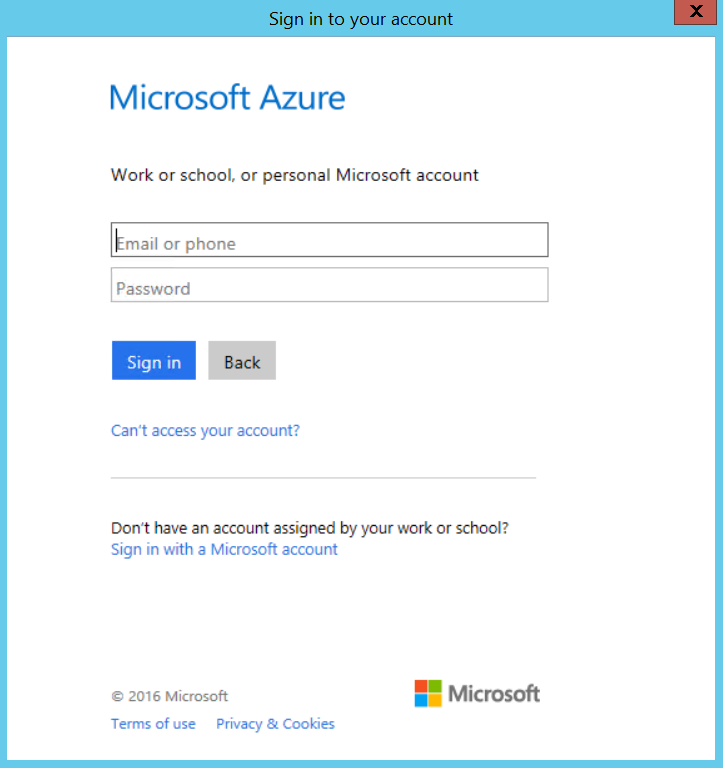
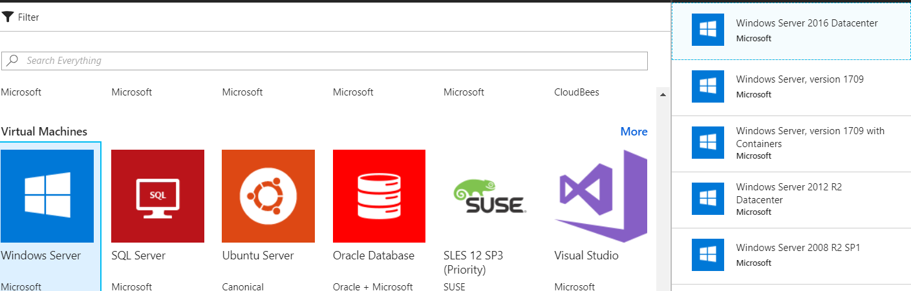
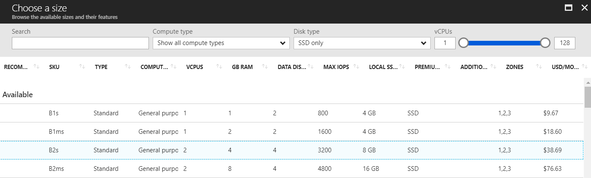
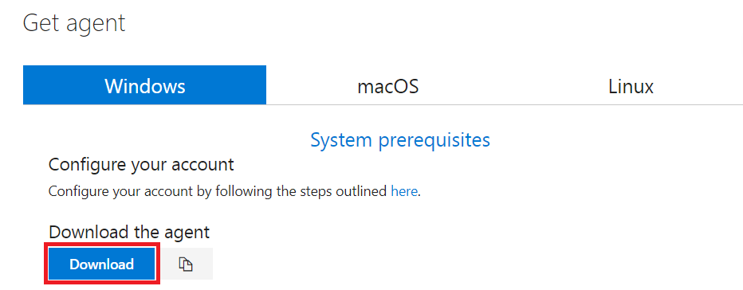
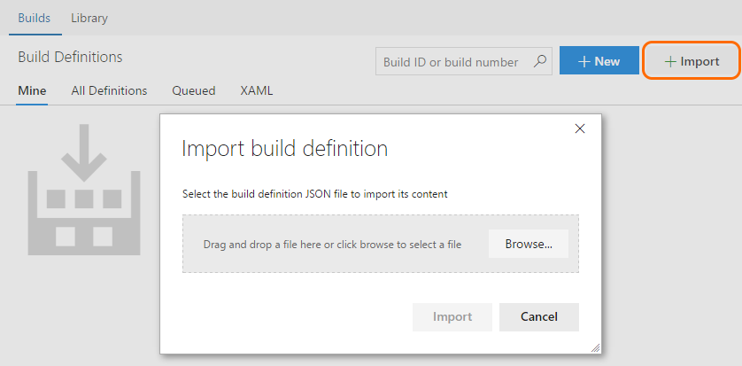

DEMO IMPLEMENTATION
=============================
## Version 1.0.0 - Updated July-17-2018

**Important Information:** This guide has been created with Python 3.7.0, Powershell and Azure CLI installed on the machine.

## Content

To be able to run this Demo, follow the instructions for the correct implementation of all the requeriments:

1. [Create VSTS Tokens.](#create-vsts-tokens)
2. Create Azure Resources

    This guide has two ways to create all the necessary Azure Resources for the Demo:
    1. [Script Resources Creation](#script-resources-creation)
        1. [Create Agent Pool on VSTS.](#1-create-agent-pool-on-vsts)
        2. [Create initial resources on Microsoft Azure.](#2-create-initial-resources-on-microsoft-azure)
        3. [Extra Installations.](#extra-installations)
    1. [Manual Resources Creation](#manual-resources-creation)
        1. [Create Agent Pool on VSTS.](#1-create-agent-pool-on-vsts-1)
        2. [Create initial resources on Microsoft Azure.](#2-create-initial-resources-on-microsoft-azure-1)
        3. [Extra Installations.](#extra-installations)

3. Complete the CI/CD on VSTS.

    1. [Import GitHub Repository to VSTS.](#import-github-repository-to-vsts)
    2. [Import Build definition on VSTS.](#import-build-definition-on-vsts)
    3. [Run the Demo.](#run-the-demo)

## Create VSTS Tokens

It is neccesarry to create two types of tokens, one for **VSTS Agent** installation and other for **ServiceEnpoints** configuration

1. From your home page on VSTS, open your profile. Go to your security details.

    

2. Create a personal access token.

    

3. Name your token. Select a lifespan for your token.

    If you have more than one account, you can also select the VSTS account where you want to use the token.

    

4. Select the scopes that this token will authorize for your specific tasks.

    In this section select the option **Agent Pools (read, manage)** for **VSTS Agent Installation**

5. When you're done, make sure to copy the token. You will use it when you configure the **VSTS Agent**.

    

## Script Resources Creation

### 1. Create Agent Pool on VSTS

Run the Python script **CreateAgentPool.py** with the following parameters regarding your VSTS Instance where your are going to configure your Demo::

    vsts_intance    --> URL of VSTS http://{AccountName}.visualstudio.com
    agentpool_name  --> Name of the new Agent Pool to create
    vsts_token      --> VSTS Token

Example:

```
CreateAzureServiceEndpoint.py "https://{AccountName}.visualstudio.com" "{PoolName}" "{VSTSToken}"
```

The Agent Pool is ready.

### 2. Create initial resources on Microsoft Azure

To run successfully this Demo, it is needed some initial resources:

1. A Resource Group to allocate on it all the necessary to run the demo.
2. A Storage Account on the Resource Group.
3. A Windows Server VM with .Net Framework 3.5 and the VSTS Agent installed and allocated on the Resource Group.

To complete this tasks you just need to run the Powershell script **CreateInitialResources.ps1** with the following parameters:

    SubscriptionId           --> Azure SubscriptionID to work on it
    ResourceGroupName        --> Name for the new Resource Group
    VmName                   --> Name for the new Virtual Machine
    VmAdminUser              --> Name of the UserAdmin of the VM
    VmAdminPassword          --> Strong password for the UserAdmin of the VM
    VstsAgentToken           --> Token created for Agent installation
    VstsAccount              --> Name of the VSTS account to allocate the Demo.  Do not send the complete URL, just the AccountName section on the URL https://{AccountName}.visualstudio.com
    VstsAgentPool            --> Agent Pool on VSTS to allocate the VSTS Agent.

Example:

```
CreateInitialResources.ps1 -SubscriptionId "{SubscriptionID}" -ResourceGroupName "{ResourceGroupName}" -VmName "{VmName}" -VmAdminUser "{AdminUser}" -VmAdminPassword "{AdminPassword}" -VstsAgentToken "{VstsToken}" -VstsAccount "{VstsAccount}" -VstsAgentPool "{VstsPoolName}"
```

During the execution of the script, the Azure Login window will appear to perform the initial creation.



***The script is going to take several minutes to complete all the tasks.

## Manual Resources Creation

### 1. Create Agent Pool on VSTS

1. On VSTS navigate to **Agent Queues** page.

    

2. Create a New Queue.

    

### 2. Create initial resources on Microsoft Azure

To run successfully this Demo, it is needed some initial resources:

1. Resource Group to allocate on it all the necessary to run the demo.
    1. On your Azure Home Page, navigate to **Resource Groups** on your left panel.

        

    2. Create a new Resource Group.

    3. Add Active Directory Application to Resource Group.

        Inside the new Resource Group go to **Access control (IAM)**.

        

        Click on **Add** button, assign **Contributor** role and search de Active Directory Application by name.

        

        Click on **Save** button.

        The Resource Group is ready.

2. Storage Account on the Resource Group.

    1. Inside the new Resource Group, click on **Add** button and search for **Storages Account**.

        

    2. Create new Storage Account with following parameters:

            Name                     --> Storage Account name
            Account kind             --> Storage (general purpose v1)
            Location                 --> Same of your Resource Group
            Replication              --> Default value
            Performance              --> Default value
            Secure transfer required --> default value
            Resource Group           --> Resource Group recently created.
            Virtual Network          --> Default value

3. Windows Server VM with .Net Framework 3.5 and the VSTS Agent installed and allocated on the Resource Group.

    1. Create Windows Server on Azure.

        1. Inside the new Resource Group, click on **Add** button and search for **Virtual Machines** section and select **Windows Server**.

            

        2. Select **Windows Server 2016 Datacenter** and click on **Create** to start the configuration.

        3. Basics Configurations

            Enter the following parameters and then click on **OK**:

                Name            --> VM Name
                VM disk type    --> SSD
                Username        --> Admin user for VM
                Password        --> Admin password for VM
                Subscription    --> Default value
                Resource Group  --> Resource Group recently created
                Location        --> Same of your Resource

            

        4. Size Configurations.

            Search and select **B2s** type, then click on **Select**.

            

        5. Settings Configurations.

            Enter the following parameters:

                Availability zone --> Default value
                Availability set  --> None

            Create new Network.

            

                Select public inbound ports  --> HTTP, HTTPS, SSH, RDP
                Diagnostics storage account  --> Storage account recently created

            Click on **OK**.

        6. Summary configuration.

            Click on **Create**. This will take several minutes.

        7. Download RDP file to crate remote session.

            

    2. Download and install .Net Framework and VSTS Agent.

        Create a remote session to your VM and follow the steps:
        1. Download and install **.Net Framework 3.5**

            Download the installer .exe from Microsoft Download Center and install the Framework.

            [Download .Net Framework 3.5](https://www.microsoft.com/en-us/download/details.aspx?id=21)

        2. Download and install VSTS Agent

            1. Inside the VM, open a browser, sign in into VSTS, and navigate to **Agent Queues** page.

                

            2. Click on **Download Agent** and download the Windows Agent Installer.

                

            3. Create the following directory and unzip the installer there.

                    C:\Agent

            4. Open the **Command Prompt (CMD)** as Administrator, naviate to **C:\Agent**and then run the **config.cmd**.

                    .\config.cmd

            5. The installer is going to the make a several questions:

                QUESTION  | ANSWER
                ------------- | -------------
                Enter Server URL  | https://{accountName}.visualstudio.com/
                Enter authentication type | Press [ENTER]
                Enter personal access token | VSTS Access Token
                Enter agent pool | Existing Agent Pool
                Enter agent name | Representative name
                Enter work folder | Press {ENTER}
                Enter run agent as service? (Y/N) | Y
                User account | Local Admin account

                The new Agent is up and running. The Agent appears on green status on the Agent Queue on VSTS.

## Extra Installations

On the VM created for the VSTS Agent, install the following programs:

1. Download and install the **Python** latest version

   [Download Python](https://www.python.org/downloads/)

    1. On the installation, select **Add Python to PATH**, then click on **Customize installation**.

        

    2. On the installation, change the destination to **C:\Python**.

        

    3. Test configuration runing `python -V` on cmd.

2. Install extra libraries

    Open the **Command Prompt** as **Administrator** and run the following commands:
    ```
    pip install selenium
    pip install pyyaml
    pip install unittest-xml-reporting
    ```

3. Copy python package to Agent tools cache

    1. Navigate to **C:\Python** and copy all the information inside.

    2. Navigate to **C:\Agent_{AgentName}\_work\tool**, on this directory, create the following sctructure, this example use Python 3.7.0.

            Python/
                3.7.0/
                    x64
                        {tool files}
                    x64.complete

    Inside **x64** directory, copy all the files from **C:\Python**.

    

4. Download and install **Google Chrome**

    Download Google Chrome from the following link and follow the install instructions
    
    [Download Google Chrome](http://chromedriver.chromium.org/downloads)

5. Download **Selenium ChromeDriver** 

    Browse to the following link
    
    [Download Google Chrome Driver](http://chromedriver.chromium.org/downloads)
    
    Click on the link to download the **Latest Release**

    

    Download the Windows-x64 version on a .zip file.

    On the VM, create the following directory:

        C:\SeleniumWebDrivers\Windows\
    
    On the new directory, copy the chromedriver.exe file downloaded on the .zip file.

## Import GitHub Repository to VSTS

To run the CI/CD process, you need to import the code before configure the Build and Release.

1. On VSTS move to your Team page.

    From the repo drop-down, select **Import repository**.

    

2. Enter the GitHub URL to clone, in this case https://github.com/OscarEEC249/SeleniumSample.git (this no need Authorization), click on **Import**.

## Import Build definition on VSTS

1. On VSTS move to your Team page. On top Menu, click on **Build and Release** option.

2. Move to **Builds** section and **Import** the **Demo-SeleniumSample-Build.json** file.

    

3. On the **Process** section, change the Build name to **Demo-SeleniumSample**.

    Select the Queue where the VSTS Agent was allocated.

    

4. On the **Get sources** section, select the repository imported.

    

5. Save Build definition.

    

## Run the Demo

1. On VSTS move to your Team page. On top Menu, click on **Build and Release** option.

2. Move to **Builds** section, open the **Demo-SeleniumSample** build and click on **Queue new build..**.

    

3. Go to **Agent Queues** page, your build is running.

4. When finish, open the  **Test** section on Build Results to verify the test results.

    
